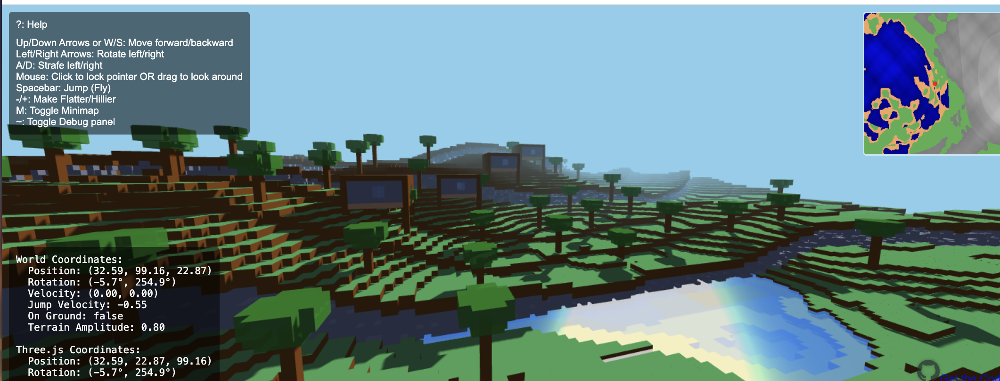

# Vibe Craft

A vibe-coded browser-based minecraft-inspired world generator playground. Built with Three.js. Features infinite procedurally generated terrain.

[Playable demo here](https://ricklindstrom.github.io/vibecraft/)

## Features

### World Generation
- Infinite procedurally generated terrain using multi-octave noise
- Dynamic chunk-based loading (16x16 blocks per chunk)
- Varied terrain with hills, mountains, and oceans
- Realistic water with depth-based transparency
- Randomly distributed trees across the landscape

### Controls
- **Movement**:
  - W/S or Up/Down Arrows: Move forward/backward
  - A/D: Strafe left/right
  - Left/Right Arrows: Turn left/right
  - Spacebar: Jump
  - +/-: Make terrain flatter/hillier
  - M: Toggle Minimap
- **Camera**:
  - Mouse: Click to lock pointer for looking around
  - Alternative: Drag mouse when pointer isn't locked
- **Debug**:
  - F: Toggle FPS counter
  - P: Toggle player details
  - ~: Open Debug panel

### Graphics
- Dynamic lighting with shadows
- Depth-based water transparency
- Distance fog for atmosphere
- Responsive window resizing

### Block Types
- Grass-covered surface
- Dirt layers
- Stone base
- Sandy ocean floor
- Wood and leaf blocks for trees

## Technical Requirements
- Modern web browser with WebGL support
- Three.js r128 (loaded from CDN)

## Quick Start
1. Open index.html in a browser
2. Enjoy

The game displays control hints in the top-left corner during gameplay.

This project is licensed under MIT, with additional DNTAI 'Do Not Train' terms (see LICENSE-DNTAI). 
